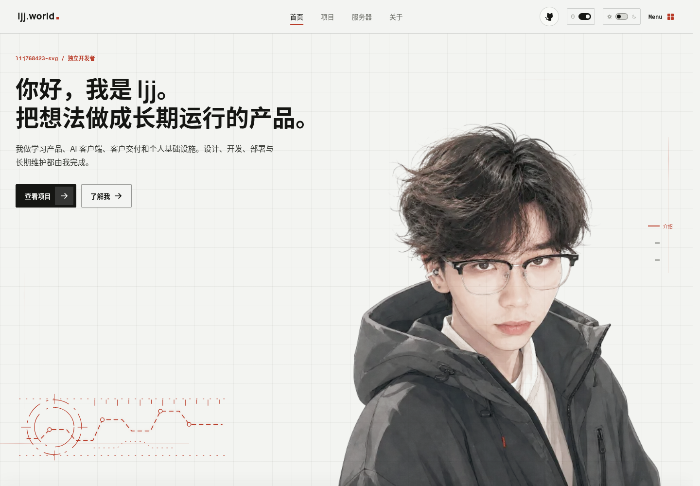

# Personal Portfolio · ljj.world

一个以动画叙事为核心的个人作品集，用来介绍产品项目、个人经历和自建服务器。线上版本：[ljj.world](https://ljj.world)。



## 特点

- 单屏首页与覆盖式章节切换
- 基于 Three.js 的 DNA 项目索引
- 可展开的项目案例与真实产品截图
- SVG 服务器拓扑、组件聚焦和服务节点动画
- HOME / DORM 双弧线桌搭画廊与全屏图片预览
- 中英文即时切换与 DecryptedText 字符解密过渡
- 深浅色主题、全局像素拖影与桌面端适配
- `prefers-reduced-motion` 无障碍降级
- Playwright 视觉与交互回归测试

## 技术栈

- React 19 + TypeScript
- Vite 8
- Motion for React
- Three.js + OGL
- GSAP
- Wouter
- Playwright

## 本地运行

需要 Node.js 20 或更高版本。

```bash
git clone https://github.com/lij768423-svg/personal-portfolio.git
cd personal-portfolio
npm ci
npm run dev
```

默认开发地址为 `http://localhost:5173`。网站运行本身不需要后端、数据库或环境变量。

## 验证

首次执行浏览器测试前安装 Chromium：

```bash
npx playwright install chromium
```

然后运行：

```bash
npm run typecheck
npm run build
npm run test:e2e
```

若已经有可用的 Chromium，可通过 `PLAYWRIGHT_CHROMIUM_PATH` 指定路径。

## 内容定制

主要内容集中在 [`src/App.tsx`](./src/App.tsx)：

- `projects`：项目标题、描述、链接和截图
- `topologyCategories`：服务器分类、服务节点和说明
- `pageMetadata`：各路由的标题、摘要和分享图片
- `AboutPage`：个人介绍与生活照片
- `deskScenes`：HOME / DORM 桌搭图片、时间和地点信息

中英文文案映射位于 [`src/i18n`](./src/i18n)，新增界面文字后可以运行：

```bash
node scripts/generate-portfolio-translations.mjs
```

样式与动效分别位于：

- [`src/styles.css`](./src/styles.css)
- [`src/effects.css`](./src/effects.css)
- [`src/components`](./src/components)

替换个人内容时，也请同步替换 `public/assets` 中的头像、生活照片和项目截图。

## 截图采集

仓库包含一套可选的 Playwright 截图采集工具，用于从真实项目刷新展示素材：

```bash
cp .env.example .env.local
npm run capture:projects -- law
npm run capture:projects -- 408
```

可用分组包括 `408`、`408-demo`、`harmony`、`ios`、`law`、`wiki`、`agent`、`writing`、`hardware`、`tailscale`、`mineradio`、`mineradio-cover`、`tools` 和 `variants`。除公开页面外，采集源必须通过环境变量显式提供；敏感密码只从进程环境读取，不写入源码或日志。完整变量见 [`.env.example`](./.env.example)。

采集后的图片不会自动视为安全。提交前请人工检查用户名、内网地址、设备名、令牌和私人数据。

## 部署

```bash
npm run build
```

将 `dist/` 部署到任意静态托管服务。由于项目使用 History API 路由，服务器必须把不存在的页面路径回退到 `index.html`。仓库提供了通用的 [Caddy 示例](./deploy/caddy/portfolio.caddy.example)。Nginx 可使用：

```nginx
location / {
    try_files $uri $uri/ /index.html;
}
```

## 项目结构

```text
personal-portfolio/
├── deploy/              # 通用部署示例
├── public/assets/       # 网站展示素材
├── scripts/             # 素材处理与截图采集
├── src/components/      # DNA、服务器拓扑和交互动效
├── src/App.tsx          # 页面、内容模型和路由
├── src/styles.css       # 主视觉系统
└── tests/               # Playwright 回归测试
```

## 许可

项目代码使用 [MIT License](./LICENSE)。`public/assets` 中的个人照片、项目截图和生成式视觉素材不包含在 MIT 授权中，具体见 [ASSET_LICENSE.md](./ASSET_LICENSE.md)。第三方代码与署名见 [THIRD_PARTY_NOTICES.md](./THIRD_PARTY_NOTICES.md)。

如果你基于这个仓库制作自己的作品集，请替换个人文案、品牌、项目内容与素材，而不是直接部署成相同身份的网站。
