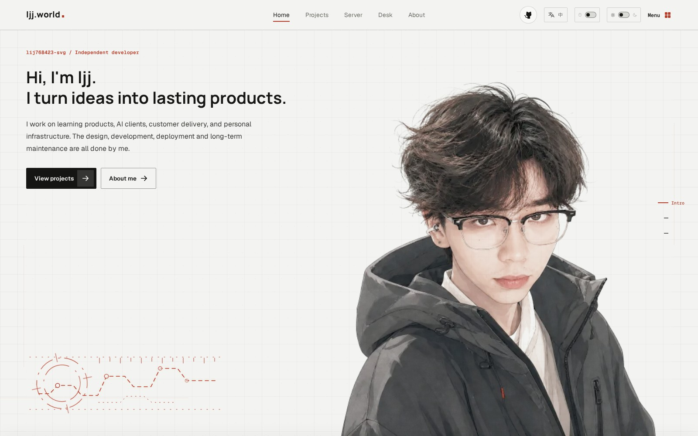
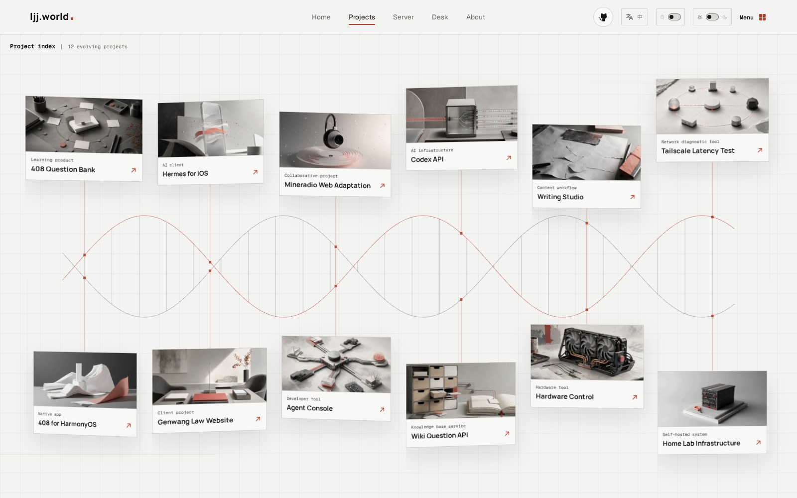
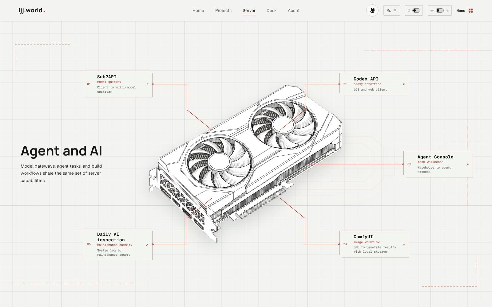
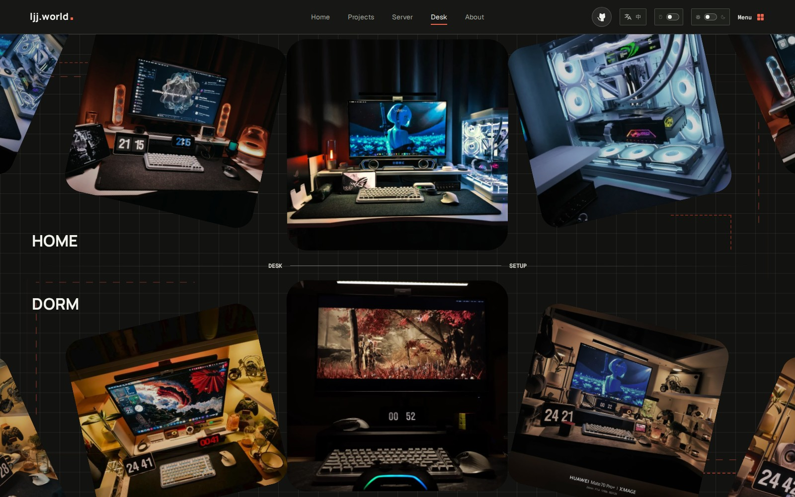
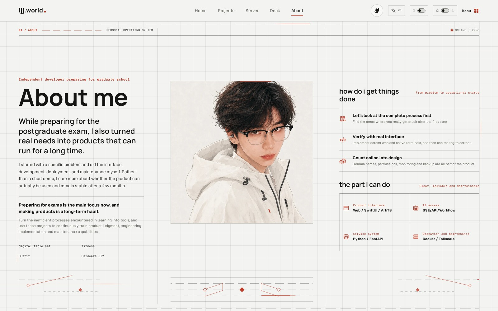

# ljj.world

> 一个围绕产品、实验项目和自建服务器展开的桌面优先交互式作品集。

[访问线上网站](https://ljj.world) · [提交问题](https://github.com/lij768423-svg/ljj-world/issues) · [MIT 许可证](./LICENSE)

[English](./README.md) · [简体中文](./README.zh-CN.md)

`ljj.world` 不是一个落地页模板。它由多个可进入的场景组成：项目索引会展开为 DNA 螺旋，服务器会拆解成其运行的服务，桌搭相册则变成两条可拖动的照片弧线。设计、开发、部署和长期维护构成同一个个人系统。



## 内容一览

<table>
  <tr>
    <td width="50%" valign="top">
      
      <strong>项目索引</strong><br />
      十二个项目围绕持续运动的 DNA 序列展开。点击卡片会在原位展开成聚焦的项目档案，而不是跳进普通卡片列表。
    </td>
    <td width="50%" valign="top">
      
      <strong>服务器故事</strong><br />
      一台线稿主机拆分为网络、硬件、AI、数据和容器模块，每个模块都能看到背后实际运行的服务。
    </td>
  </tr>
  <tr>
    <td width="50%" valign="top">
      
      <strong>桌搭归档</strong><br />
      HOME 与 DORM 使用相反方向的弧线相册。照片支持拖动、随鼠标倾斜、全屏查看，并保持在原来的分组内浏览。
    </td>
    <td width="50%" valign="top">
      
      <strong>关于，不止是简介</strong><br />
      个人经历、做事方法、能力范围和兴趣爱好使用与产品场景一致的视觉系统表达。
    </td>
  </tr>
</table>

## 体验原则

- **每个路由都有自己的视角。** Home、Projects、Server、Desk 和 About 是不同的场景，不是重复的页面壳子。
- **动效承担结构表达。** 项目螺旋、服务器拆解、相册入场、主题擦除和语言切换都在说明层级或状态，而不是单纯装饰。
- **交互保持在当前语境。** 项目卡片原位展开；服务器模块点击聚焦、空白处复位；桌搭照片全屏后仍在原来的分组里切换。
- **视觉系统可以被读懂。** 克制的网格、红色连接线、稳定的顶部 Dock 和减弱动态模式，让效果不会淹没内容。

## 技术结构

| 关注点 | 实现 |
| --- | --- |
| 应用 | React 19、TypeScript、Vite 8、Wouter |
| 动效 | Motion for React、GSAP、自定义 CSS 编排 |
| 3D 与画布 | Three.js DNA 螺旋、OGL 环形画廊、Canvas 指针效果 |
| 界面 | 网格视觉系统、深浅主题、中英文文字过渡 |
| 质量 | Playwright 视觉与交互回归测试、`prefers-reduced-motion` 降级 |

网站本身是纯静态的：不依赖运行时数据库、API、统计服务或必填环境变量。内容保存在仓库内，生产环境是普通静态构建产物。

## 本地运行

需要 Node.js 20 或更高版本。

```bash
git clone https://github.com/lij768423-svg/ljj-world.git
cd ljj-world
npm ci
npm run dev
```

Vite 默认运行在 `http://localhost:5173`。桌面端是主要设计目标；移动端保持全部路由可用，但会有意简化最重的连续动效。

## 验证改动

首次运行浏览器测试前安装 Chromium：

```bash
npx playwright install chromium
npm run typecheck
npm run build
npm run test:e2e
```

若 Chromium 已安装在其他位置，可在运行测试前设置 `PLAYWRIGHT_CHROMIUM_PATH`。

## 改成你自己的作品集

推荐按“内容、素材、视觉细节”的顺序替换。

| 要改什么 | 位置 |
| --- | --- |
| 项目、外部链接、服务器服务、页面元数据 | [`src/App.tsx`](./src/App.tsx) |
| 中英文映射与全局文字过渡 | [`src/i18n`](./src/i18n) |
| DNA 项目索引与纸张式项目详情 | [`src/components/ProjectHelix.tsx`](./src/components/ProjectHelix.tsx) |
| 服务器主机和服务拆解 | [`src/components/ServerExplodedStory.tsx`](./src/components/ServerExplodedStory.tsx) |
| 桌搭弧线画廊与全屏查看器 | [`src/components/CircularGallery.tsx`](./src/components/CircularGallery.tsx) |
| 主视觉与页面布局 | [`src/styles.css`](./src/styles.css) |
| 可复用交互层 | [`src/effects.css`](./src/effects.css) 与 [`src/components/effects`](./src/components/effects) |

新增中文文案后，可以运行：

```bash
node scripts/generate-portfolio-translations.mjs
```

发布衍生版本前，请替换身份相关文案和 `public/assets` 中的素材。截图采集工具是可选的，只在刷新项目预览图时使用：

```bash
cp .env.example .env.local
npm run capture:projects -- law
```

支持的采集分组包括 `408`、`408-demo`、`harmony`、`ios`、`law`、`wiki`、`agent`、`writing`、`hardware`、`tailscale`、`mineradio`、`mineradio-cover`、`tools` 和 `variants`。可选源地址见 [`.env.example`](./.env.example)。任何截图提交前都应人工检查，避免公开内网地址、设备名、凭据和用户数据。

## 部署

```bash
npm run build
```

将 `dist/` 部署到任意静态托管服务即可。项目使用 History API 路由，因此未知路径需要回退到 `index.html`。仓库提供通用的 [Caddy 示例](./deploy/caddy/portfolio.caddy.example)。Nginx 可使用：

```nginx
location / {
    try_files $uri $uri/ /index.html;
}
```

## 目录说明

```text
personal-portfolio/
├── docs/screenshots/    # 从运行中网站截取的 README 展示图
├── deploy/              # 静态托管示例
├── public/assets/       # 作品集专属图片和生成式视觉素材
├── scripts/             # 素材处理、截图和翻译辅助脚本
├── src/components/      # 视觉场景与交互组件
├── src/i18n/            # 语言切换与文字映射
├── src/App.tsx          # 内容模型、路由和页面组成
└── tests/               # Playwright 回归测试
```

## 许可证与素材使用

源码和文档使用 [MIT License](./LICENSE)。

`public/assets` 与 `docs/screenshots` 中的视觉素材不自动适用 MIT，其中包括个人照片、身份相关文案、产品截图、标志和生成式视觉内容。具体使用边界见 [ASSET_LICENSE.md](./ASSET_LICENSE.md)。如果基于本仓库制作自己的作品集，请先替换这些素材。

部分动效组件参考或改编自 React Bits，依赖与署名信息见 [THIRD_PARTY_NOTICES.md](./THIRD_PARTY_NOTICES.md)。
